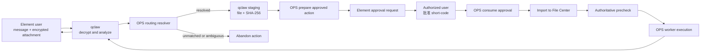
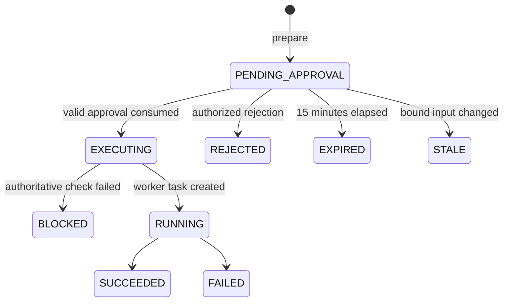

# qclaw Element Approval And OPS Execution Design

> **文档状态（2026-08-06）**：本文档描述旧的单动作 `AiActionApproval` 流程，继续作为兼容路径设计参考。多步骤消息的当前主流程以 [2026-08-06-message-execution-plan-design.md](2026-08-06-message-execution-plan-design.md) 为准。

Date: 2026-07-22
Status: Approved

## 1. Context

qclaw runs on the same Windows host as OPS. qclaw already owns the Element/Matrix integration, including encrypted-room access and AI analysis. OPS already owns package management, deployment, rollback, package cleanup, database DML controls, task execution, and audit records.

The current OPS policy intentionally blocks AI/MCP tool tokens from directly invoking high-risk operations such as package upload, deploy execution, rollback, destructive package cleanup, and DML. This design preserves that boundary while allowing an authorized Element user to approve a specific immutable action.

## 2. Goals

- Let qclaw read an E2EE Element room, parse an explicitly triggered request, and download encrypted package attachments.
- Deterministically associate message content with a managed OPS system and service.
- Ask an authorized Matrix user to approve a complete immutable action in Element.
- Execute an approved release, rollback, package cleanup, or DML action without giving qclaw the underlying dangerous scopes.
- Keep package paths consistent with the existing OPS File Center and release pipeline.
- Preserve OPS prechecks, taskization, package protection, DML policy, and audit records.
- Make approvals single-use, short-lived, idempotent, and resistant to stale input or replay.

## 3. Non-Goals

- OPS will not read Matrix rooms, manage Matrix E2EE keys, download Matrix media, or run AI analysis.
- qclaw will not receive `deploy:execute`, `package:write`, `package:cleanup`, `db:write`, or wildcard scopes.
- Approval will not authorize arbitrary MCP tool names or arbitrary local paths.
- A failed deployment will not automatically trigger rollback.
- Failed DML will not be automatically retried.
- Web UI uploads and releases will continue to work without Matrix routing tickets.

## 4. Fixed Decisions

- qclaw and OPS are co-located and use a controlled shared staging path.
- Target Element rooms are E2EE rooms; qclaw is a managed and verified Matrix device.
- A task is triggered only by an explicit bot mention or command prefix.
- qclaw performs AI parsing, but OPS makes the final deterministic system/service routing decision.
- Authorized Matrix users are managed through an explicit allowlist, not display names or room power levels.
- One allowlisted user is sufficient to approve an action.
- Approval uses `批准 <short-code>`, is valid for 15 minutes, and can be consumed once.
- One immutable approval covers package import, authoritative precheck, and deploy execution.
- Rollback, package cleanup, and DML always require separate actions and approvals.
- Any package, target, pipeline, SQL, configuration, or scope expansion invalidates the approval.

## 5. Responsibility Boundary

### 5.1 qclaw

qclaw is responsible for:

- Matrix sync state, E2EE device keys, device verification, event decryption, and encrypted attachment decryption.
- Trigger detection from bot mentions or command prefixes.
- AI extraction of action type, system/service hints, environment, targets, reason, and DML intent.
- Writing decrypted attachments to the controlled staging directory.
- Computing a streaming SHA-256 while downloading the attachment.
- Calling the OPS routing and approval MCP tools.
- Posting approval summaries and mentioning eligible approvers returned by OPS.
- Verifying that an approval reply comes from the expected Matrix event relationship before forwarding it to OPS.
- Polling action state and reporting progress and results to the original room.
- Cleaning qclaw-owned staging files after completion, rejection, or expiry.

### 5.2 OPS

OPS is responsible for:

- System/service routing configuration and deterministic routing decisions.
- Authorized Matrix user policies by action type and environment.
- Staging-path validation, package inspection, package import, and canonical package resolution.
- Immutable action manifests, action digests, approval code hashes, expiry, atomic consumption, and audit.
- Final authorization and execution policy.
- Authoritative release precheck, deployment, rollback, cleanup protection, DML controls, and task execution.
- Idempotent status retrieval and domain-level audit records.

OPS trusts qclaw as the Matrix identity event attester because OPS deliberately does not hold Matrix E2EE keys. The qclaw MCP token must therefore be local-only, narrowly scoped, revocable, and preferably run under a separate OS service account.

## 6. End-To-End Flow



## 7. Message-To-System Routing

### 7.1 Managed Mapping

System management gains a `message_routing` object:

```json
{
  "name": "crypto-trader",
  "display_name": "量化系统",
  "message_routing": {
    "enabled": true,
    "aliases": ["量化", "量化交易", "crypto trader", "crypto-trader"],
    "keywords": ["策略", "交易程序", "行情", "风控"],
    "priority": 100
  }
}
```

Service-level aliases live under `Service.template_variables.message_routing` so they follow the current service metadata pattern.

### 7.2 Resolver Contract

qclaw calls the read-only `ops.routing.resolve_message_target` tool with Matrix event identity, a content hash, and AI-extracted hints. It does not ask OPS to perform fuzzy AI analysis.

OPS resolves in this order:

1. Exact canonical system name.
2. Exact configured system alias.
3. Unique canonical service name or service alias, then its parent system.
4. Unique highest-priority configured keyword match.

The outcomes are:

- `RESOLVED`: return canonical system/service and a signed routing ticket.
- `UNMATCHED`: no ticket and no action.
- `AMBIGUOUS`: no ticket and no automatic candidate selection.

The routing ticket is valid for 15 minutes and binds room ID, event ID, content SHA-256, canonical system/service, and routing configuration revision. Every qclaw `prepare_*` call requires this ticket. The ticket prevents qclaw from replacing the canonical system or service after routing.

For unmatched or ambiguous messages, qclaw reports that no unique OPS project mapping exists, abandons execution, and removes any staged attachment. OPS records the event ID, content hash, candidate systems, and reason, but does not persist the complete sensitive message body.

## 8. Package Staging And Canonical Paths

There are three distinct path domains:

| Domain | Canonical form | Purpose |
|---|---|---|
| qclaw staging | `<QCLAW_STAGING_DIR>/<room-hash>/<event-id>/<name>` | Approval-time decrypted input |
| OPS File Center | `<UPLOAD_DIR>/<safe-package-name>` | The only local deployment source |
| Remote server | Pipeline-derived path such as `/tmp/<name>` | Deployment distribution target |

`QCLAW_STAGING_DIR` and `UPLOAD_DIR` must be separate sibling directories. The recommended local default is `<APP_DATA_DIR>/qclaw-staging` for staging and the existing runtime `UPLOAD_DIR` for canonical packages.

qclaw writes to a `.part` file, computes SHA-256 while streaming, then atomically renames the completed staged file. OPS preparation validates:

- The resolved real path remains under `QCLAW_STAGING_DIR`.
- The path is not a symlink, junction, reparse-point escape, directory, or special file.
- The filename is normalized by the existing package naming policy.
- The package extension and size comply with the File Center retention/upload policy.
- The calculated size and SHA-256 match the qclaw values.

The staging path is stored only in the approval action. It must never be copied into `DeployRequest.variables`, pipeline step configuration, `ToolPlan.package_name`, or deployment records.

### 8.1 Approved Import

After approval, OPS reads the staged path from the approval record rather than from new caller arguments. OPS verifies size and SHA-256 again, streams the content to `<UPLOAD_DIR>/<name>.import-<uuid>.tmp`, hashes the copied bytes, and atomically replaces the destination only after validation.

- Same name and same SHA-256: reuse the existing package.
- Same name and different SHA-256: block; overwrite requires a new explicit action.
- Source content changed after approval: mark the action `STALE` and do not import.
- Import succeeded but final precheck failed: retain the imported package as an unreleased File Center package; never delete it automatically.

### 8.2 Unified Release Resolution

Add a shared `resolve_deploy_package(package_name, expected_sha256)` service. It returns only the canonical `package_path(package_name)` under `UPLOAD_DIR` and validates the `DeployPackage` metadata and current SHA-256.

For qclaw-originated plans, existing pipeline `local_path` overrides and compatibility fallbacks are forbidden. Web and qclaw releases should converge on the same resolver. Legacy fallbacks may remain temporarily for non-qclaw compatibility but must not be reachable from an approved qclaw action.

The action and resulting plan bind `package_id`, `package_name`, and SHA-256. `ToolPlan.package_name` remains for compatibility; package identity and hash are also stored in the structured payload.

## 9. Minimal MCP Surface

> **实现现状（2026-09-11 生产发版审计）**：下表里的 `ops.approval.prepare_release` /
> `prepare_rollback` / `prepare_package_cleanup` / `prepare_dml` **从未注册**。实际实现
> 收敛为**计划式审批**：`ops.approval.prepare_plan`（步骤类型覆盖 RELEASE / ROLLBACK /
> DML / PACKAGE_CLEANUP / FILE_UPLOAD / MATRIX_PULL）+ `ops.approval.execute_plan`。
> `tool_policy.APPROVAL_TOOL_MAP` 已改为指向真实注册的工具，并有契约测试
> （`tests/test_strict_prod_confirmation.py`）防止再次指向不存在的工具。

Add a `qclaw_approval` discovery profile that exposes only required read and workflow capabilities:

- `ops.routing.resolve_message_target`
- `ops.approval.prepare_release`（未实现 → 见上方说明，实际用 `ops.approval.prepare_plan`）
- `ops.approval.prepare_rollback`（未实现 → 同上）
- `ops.approval.prepare_package_cleanup`（未实现 → 同上）
- `ops.approval.prepare_dml`（未实现 → 同上）
- `ops.approval.execute`
- `ops.approval.reject`
- `ops.approval.get`
- Existing required read/status tools

The qclaw token scopes are limited to `approval:prepare`, `approval:execute`, `approval:read`, and required read scopes. It never receives raw dangerous scopes.

`ops.approval.execute` accepts an `action_id` plus approval evidence. It never accepts a caller-selected tool name. An internal `ApprovalExecutor` dispatches a fixed `action_type` allowlist to existing OPS domain services. Its internal `ToolContext` uses `auth_type=approval_executor` and carries the consumed approval ID and approved Matrix user. No external credential can create this context.

Existing high-risk MCP tools remain blocked for normal `tool_token` contexts.

## 10. Approval Policy And State

### 10.1 Allowlist

OPS is the source of truth for Matrix approvers:

```json
{
  "matrix_user_id": "@operator:example.com",
  "enabled": true,
  "actions": ["release", "rollback", "package_cleanup", "dml"],
  "environments": ["test", "prod"]
}
```

Display names and Matrix room power levels are not authorization inputs. A preparation response includes eligible Matrix user IDs so qclaw can mention the correct approvers.

### 10.2 Action State



The action manifest is normalized to canonical JSON and hashed into `action_digest`. The short approval code is random and stored only as a salted hash. It is visible in Element but remains useful only with an authorized Matrix identity, matching room/event relationship, unexpired action, and unchanged digest.

Approval evidence includes:

- Action ID and short code.
- Approver Matrix user ID.
- Room ID and approval event ID.
- Approval message timestamp.
- Relationship to the qclaw approval request event.

Atomic compare-and-set consumption must ensure only one caller can transition a pending action to execution. Repeated calls return the same job/action status and never execute twice.

The audit actor is recorded as `matrix:<user-id> via qclaw / approval:<action-id>`.

## 11. Data Model

Extend the existing `AiActionApproval` model rather than adding an unrelated approval store. Retain `request_payload` as the immutable action manifest and add fields required for policy and operations:

- `action_digest`
- `approval_code_hash`
- `room_id`
- `request_event_id`
- `approval_event_id`
- `content_sha256`
- `routing_ticket_digest`
- `routing_config_revision`
- `expires_at`
- `consumed_at`
- `rejected_by` and `rejected_at`
- `package_name`, `package_sha256`, and `package_size_bytes`
- `execution_job_id`
- `execution_result`
- `failure_reason`
- `updated_at`

Status values are `PENDING_APPROVAL`, `REJECTED`, `EXPIRED`, `STALE`, `EXECUTING`, `BLOCKED`, `RUNNING`, `SUCCEEDED`, and `FAILED`.

Routing tickets may be stateless HMAC-signed values. The matching route result and ticket digest are copied into the approval action and normal tool-call audit, avoiding a separate routing table unless operational reporting later requires one.

## 12. Domain Workflows

### 12.1 Release

`prepare_release` binds package identity, system, service, environment, exact server list, pipeline ID, pipeline step snapshot, service configuration fingerprint, reason, and routing ticket. Preparation performs staged-package inspection and target/configuration checks without writing `UPLOAD_DIR`.

After approval, OPS imports the package, creates the canonical `ToolPlan`, and runs the authoritative release precheck. A changed target set, pipeline, package, or service configuration marks the action stale or blocked; execution never silently expands scope.

### 12.2 Rollback

`prepare_rollback` accepts only an existing deployment ID and reuses the current rollback plan service. It binds the original deployment, exact servers, rollback package and SHA-256, rollback mode, and health checks. The rollback package must still resolve under `UPLOAD_DIR` at execution time. A release approval cannot authorize rollback.

### 12.3 Package Cleanup

`prepare_package_cleanup` builds exact candidates from File Center records and the existing retention preview. It never accepts arbitrary filesystem paths. The approval summary includes each package name, SHA-256, size, and cleanup reason.

Execution rechecks running deployments, failed retry windows, rollback candidates, explicit protection, and latest-success retention. A newly protected package is skipped and reported. Execution may narrow the approved deletion set but may never add candidates.

### 12.4 DML

qclaw may generate SQL from natural language, but `prepare_dml` must call the existing DML preview service and bind connection, database, target tables, exact SQL and SHA-256, expected affected rows, samples, `max_affected_rows`, and reason.

Existing prohibitions remain: no DDL, privilege statements, multi-statements, locks, or `UPDATE`/`DELETE` without `WHERE`. Execution repeats policy and row-impact checks. A current estimate above the approved maximum blocks execution. Results and verification SQL are audited and returned through existing masking rules.

## 13. Failure And Recovery Rules

- E2EE decrypt, media download, or hash failure: remove `.part`; do not create an action.
- Routing unmatched or ambiguous: abandon; do not create an action or import a package.
- Preparation blocked: return structured blockers to qclaw.
- Unauthorized approval attempt: audit the denial; keep the action pending.
- Expired approval: mark `EXPIRED`; require a new preparation.
- OPS call timeout: qclaw queries by action ID; it does not recreate or re-execute.
- Package import failure: remove destination temp files; do not start deployment.
- Final release precheck failure: mark `BLOCKED`; do not deploy.
- Partial deploy failure: report failed servers and logs; do not auto-rollback.
- DML failure after execution begins: rely on database transaction rollback; do not auto-retry.
- Partial cleanup failure: report per-package outcomes; do not expand or automatically retry deletion.
- qclaw or OPS restart: recover from Matrix sync state plus persisted action/job state.

## 14. Audit Requirements

Every routing, preparation, approval/rejection, consumption, domain execution, and status transition records:

- qclaw token identity.
- Matrix room, request event, approval event, and approver ID.
- Content hash rather than full sensitive room text.
- Routing result and configuration revision.
- Action digest and immutable manifest.
- Package ID/name/SHA-256 where applicable.
- Domain plan/deployment/job/DML execution IDs.
- Result, blockers, failures, and timestamps.

## 15. Verification Strategy

1. Unit tests for canonical JSON, action digests, short-code hashing, expiry, allowlist decisions, and routing ticket validation.
2. Windows path tests for normalization, traversal, symlink/junction/reparse-point escapes, and allowed staging roots.
3. Routing tests for canonical names, aliases, service-parent resolution, keyword priority, unmatched, ambiguity, and configuration revision changes.
4. Permission tests proving qclaw cannot call raw deploy, rollback, upload, cleanup, or DML execution tools.
5. Atomic concurrency tests proving one approval creates at most one execution job.
6. Package integration tests for staged import, source mutation, same-name/same-hash reuse, same-name/different-hash blocking, and temp cleanup.
7. Release regression tests proving Web UI and qclaw flows both deploy from canonical `UPLOAD_DIR` packages.
8. Pipeline tests proving qclaw actions cannot inject or override `local_path`.
9. Rollback and package-retention tests for package SHA checks and changing protection state.
10. DML tests for SQL identity, forbidden SQL, row limits, data changes between preview and execution, masking, and transaction failure.
11. qclaw contract tests for decrypted attachment handoff, Matrix event identity, approval-reply relationships, and status reporting.
12. Fault-injection tests for qclaw restart, OPS restart, worker failure, MCP timeout, and duplicate Matrix events.

## 16. Rollout

1. Add schema migration and approval/routing services without changing existing high-risk policy.
2. Add the qclaw-specific MCP profile and narrowly scoped token template.
3. Add system/service message-routing management fields and deterministic resolver.
4. Add package staging validation, canonical resolver, and approval prepare tools.
5. Add atomic approval execution and domain dispatch.
6. Integrate qclaw against the MCP contract in a test room and non-production environment.
7. Verify duplicate events, restart recovery, and package path consistency.
8. Enable production actions only after explicit OPS capability settings and allowlist review.

## 17. Acceptance Criteria

- A message that cannot map uniquely to an OPS system cannot create an approval or execute an action.
- qclaw can prepare and complete an approved test release from an encrypted Element attachment on the shared host.
- The deployed package is read only from canonical `UPLOAD_DIR` and matches the approved SHA-256.
- A changed package, target set, pipeline, service configuration, SQL, or cleanup candidate set cannot expand execution under an existing approval.
- A single valid approval event can create at most one execution job.
- qclaw cannot directly invoke any underlying dangerous tool.
- Rollback, cleanup, and DML require separate approvals and retain existing domain safeguards.
- All actions can be traced from Matrix event and approver to OPS action, job, deployment, package, or DML audit record.
