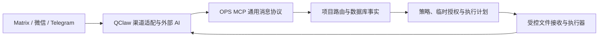
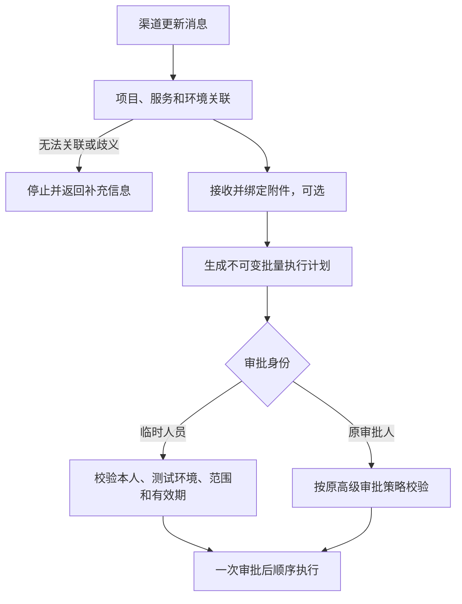

# OPS 临时自审批与多渠道消息协议设计

日期：2026-08-11
状态：已确认

## 1. 背景

测试环境处于频繁更新阶段，继续要求原指定审批人逐次审批会降低发布效率。系统需要支持由原审批人一次性授权固定消息用户，在限定时间、系统、测试环境和动作范围内审批自己发起的更新计划。授权到期后必须自动恢复原审批链，且不能通过清空审批名单实现。

当前消息审批流程以 Matrix 字段建模。后续还需要通过 QClaw 接入微信和 Telegram，因此 OPS 内部不能继续扩展 Matrix 专属字段和分支。

OPS 当前还包含内置 AI 分析、分析记录和工作流。外部 AI 已能承担分析职责，这部分能力应删除，使 OPS 收敛为事实查询、策略、审批、文件接收和受控执行平台。

## 2. 目标

- 原指定审批人在消息渠道内一次确认，为固定用户开通临时自审批。
- 临时用户只能审批本人发起、指定系统和明确测试环境中的允许动作。
- 授权支持按天或周，默认 1 天，最长 4 周，到期自动失效。
- 原审批人保留高级审批、撤销和兜底能力，但不再被每次测试更新反复通知。
- 一个不可变批量执行计划只审批一次，包上传不单独审批。
- Matrix、微信、Telegram 共用同一套 OPS 消息、审批和执行协议。
- 提供通用只读帮助能力，方便查询可用操作和申请方式。
- 删除 OPS 内置 AI 分析能力及未使用的数据表。
- 保持本地部署精简，不增加渠道连接器、轮询任务或常驻调度器。

## 3. 非目标

- OPS 不负责读取渠道消息、下载渠道附件或向渠道发送回复。
- OPS 不实现 QClaw 的 Matrix、微信和 Telegram 适配逻辑。
- 不支持跨渠道、跨会话或跨 QClaw 渠道实例审批。
- 不实现完整通用 RBAC 系统。
- 不允许临时人员授权、续期或转授其他人员。
- 不放开生产环境、DML、回滚、删包或清包。

## 4. 方案选择

采用独立的临时审批授权记录，作为现有审批策略的受限覆盖层，不修改 Tool Token 或系统的原审批人配置。

未采用以下方案：

- 通用 RBAC 临时角色：扩展性较强，但对当前单人小团队过重。
- 临时修改原审批人配置：恢复、并发覆盖和审计风险较高。
- 跳过审批：会丢失不可变计划和一次性确认凭证，不接受。

## 5. 职责边界



QClaw 和外部 AI 负责：

- 渠道消息接收与回复；
- 渠道原始身份和消息元数据提取；
- 附件下载到本机受控暂存目录；
- 自然语言理解、意图识别、分析和计划建议；
- 将 OPS 的结构化结果格式化后返回原渠道。

OPS 负责：

- 数据库中的系统、服务、环境和审批策略事实；
- 消息与 OPS 项目的确定性关联；
- 路由票据、授权、计划和审批完整性校验；
- 文件哈希绑定和受控上传；
- 不可变执行计划与顺序执行；
- 审计、结果和帮助信息。

## 6. 通用消息上下文

所有渠道相关入口统一接收 `message_context`：

```json
{
  "channel": "matrix | wechat | telegram",
  "channel_account_id": "QClaw 渠道实例标识",
  "conversation_id": "房间、群或会话标识",
  "message_id": "渠道消息唯一标识",
  "sender_id": "渠道稳定用户标识",
  "content_sha256": "标准化消息内容摘要"
}
```

内部生成两个规范键：

```text
actor_key = channel:channel_account_id:sender_id
conversation_key = channel:channel_account_id:conversation_id
```

显示名称、昵称和消息正文中的 `@用户名` 只能用于展示，不能用于鉴权。高风险流程缺少稳定的 `sender_id`、`conversation_id` 或 `message_id` 时，只允许帮助和只读查询。

同一审批链必须保持 `channel`、`channel_account_id` 和 `conversation_id` 一致。

## 7. 数据模型

新增 `temporary_approval_grants`：

- `id`；
- `beneficiary_actor_key`；
- `channel`、`channel_account_id`、`conversation_id`；
- `system_id`、`environment_id`；
- `allowed_actions`；
- `reason`；
- `starts_at`、`expires_at`；
- `status`：`PENDING`、`ACTIVE`、`REVOKED`、`EXPIRED`、`REJECTED`；
- `requested_by_actor_key`、`approved_by_actor_key`；
- `request_message_id`、`confirmation_message_id`；
- `request_digest`；
- `confirmation_code_hash`、`confirmation_consumed_at`；
- `revoked_by_actor_key`、`revoked_at`、`revoke_reason`；
- `created_at`、`updated_at`。

执行计划补充或统一以下字段：

- 通用消息上下文；
- `requested_by_actor_key`；
- `authorized_identities`；
- `temporary_grant_id`；
- 审批策略快照和摘要。

路由票据必须签名绑定完整消息上下文、系统、服务、路由版本和有效期。

Tool Token 的渠道约束收敛为结构化的渠道实例、会话绑定和 `approver_identities`。现有 Matrix 字段只在兼容层读取，不再成为内部事实源。

## 8. 权限层级

### 8.1 原审批人

原审批人来自现有 Tool Token 或系统/服务审批策略，具有：

- 确认或拒绝临时授权申请；
- 审批任意符合原策略的执行计划；
- 提前撤销临时授权；
- 查看完整授权审计。

### 8.2 临时审批人

临时审批人只能：

- 审批本人发起的执行计划；
- 操作授权中指定的系统和测试环境；
- 在授权有效期内执行允许动作；
- 查看与本人和授权范围相关的帮助及状态。

临时审批人不能创建、确认、延长、转授或撤销临时授权。

## 9. 临时授权流程

申请人可以发送：

```text
申请临时自审批 crypto-trader 测试环境 1周，原因：紧急联调
```

原审批人也可以发送：

```text
为 @user 开通 crypto-trader 测试环境临时自审批 1周
```

两种方式都只创建 `PENDING` 申请。OPS 返回不可变申请摘要和一次性确认码，原审批人必须在同渠道、同渠道实例和同会话中确认后才能激活。

确认码有效期为 15 分钟且只能使用一次。授权默认 1 天，支持按天或周，最长 4 周。超过 1 周时，确认摘要突出显示风险和准确失效时间，但仍只需一次确认。

同一用户、系统和环境已有有效授权时，不叠加授权。延长时重新创建申请并由原审批人确认。

授权不依赖后台定时任务。查询、审批和执行时实时比较 `expires_at`；过期后按 `EXPIRED` 处理。

## 10. 更新与审批流程



要求：

- 每条更新需求生成一个完整批量计划；
- 包上传、目标机器、服务顺序、命令、环境变量和检查步骤都进入同一计划摘要；
- 包上传包含在该计划的一次审批中，不产生独立审批；
- 任一计划内容或包哈希变化时，旧审批码失效；
- 临时人员消费审批码时，实时校验授权仍为 `ACTIVE` 且 `requested_by_actor_key` 等于本人；
- 授权到期或撤销后，临时人员不能消费旧码，原审批人仍可审批已有计划；
- 执行开始前最后校验一次授权；执行已经开始后不因授权中途到期而中断。

## 11. 允许和禁止的动作

临时自审批允许：

- 渠道附件对应的包接收和受控上传；
- 发布部署；
- 服务启动、停止、重启和重建；
- 健康检查和发布后验证。

临时自审批禁止：

- 生产环境操作；
- 任意 DML；
- 回滚；
- 删包和清包；
- 不在计划中的任意远程命令；
- 修改审批策略或临时授权。

环境必须由数据库中的 `SystemEnvironment.category == "test"` 明确判定，不通过名称关键字猜测。

## 12. 文件和包处理

消息触发场景中，QClaw 使用渠道原生能力下载 Matrix、微信或 Telegram 附件到本机受控暂存目录，再调用 OPS 上传能力。OPS 不保存三个渠道的访问凭据。

OPS 校验并记录：

- 通用消息上下文；
- 文件名、大小和 SHA-256；
- 本机受控来源路径；
- 目标服务器和受控发布路径；
- 对应执行计划和审批摘要。

非消息触发场景继续使用 OPS Web 上传。两种入口最终进入同一文件记录和执行计划流程。

## 13. 通用帮助能力

新增只读工具：

```text
ops.help.query
```

支持：

```text
帮助
帮助 临时审批
帮助 包上传
帮助 部署
帮助 crypto-trader 测试环境
帮助 全部
```

帮助内容从工具注册信息、数据库中的系统/环境和真实审批策略动态生成，不建立独立帮助配置源。

默认按当前用户、渠道会话和项目上下文过滤。`帮助 全部` 展示完整目录，并标记“可用、需授权、禁止”。返回操作用途、必填信息、审批要求、示例和不可执行原因，但不返回 Token、凭据或敏感命令。

## 14. MCP 能力

只新增必要能力：

- `ops.approval.temporary_access`：通过 `request`、`confirm`、`revoke` 操作临时授权；
- `ops.help.query`：查询能力、权限和申请方式。

渠道触发的部署和其他写操作继续通过现有执行计划入口，不为微信或 Telegram 复制工具。

## 15. Web UI

在现有 `MCP / AI` 管理区域增加精简的临时授权列表，支持：

- 查看待确认、有效、已撤销和已过期授权；
- 原审批人确认待处理申请；
- 原审批人提前撤销；
- 查看授权摘要和审计详情。

Element、微信和 Telegram 是主要交互入口，Web UI 只作为管理和故障兜底，不新增独立审批系统。

## 16. AI 分析能力移除

删除：

- `ops.analyze_diagnostics`；
- 全部 `ops.ai.*` 分析存取工具；
- 内置 AI 分析工作流；
- AI 分析 prompts 和专属 MCP resources；
- `/api/v2/ai/analysis`；
- AI 分析和 AI 工作流前端页面、路由及 API 客户端；
- 报告中心 `ai_analysis` 类型；
- `AiAnalysisRun`、`AiAnalysisFinding` 模型；
- `ai_analysis_findings`、`ai_analysis_runs` 数据表及数据；
- 相关帮助、文档和测试。

保留原始事实查询工具、外部 Agent 调用元数据、执行计划和审批能力。`AiActionApproval` 是通用动作审批的历史命名，本次不改名。

## 17. 兼容与迁移

- 新接口使用 `message_context`。
- 旧 Matrix `room_id`、`event_id` 和审批人参数在 API 边界兼容并转换为 `matrix/default/...`。
- 现有审批和执行历史迁移到通用渠道字段后保留。
- 原 Matrix Tool Token 绑定和审批人配置迁移为结构化渠道身份。
- 核心服务和新代码不得继续新增 Matrix 专属字段。
- 不为微信和 Telegram 建立专属数据库表或执行分支。
- AI 分析表通过向前迁移直接删除，因为当前没有历史数据。

## 18. 安全、异常和审计

- Matrix、微信和 Telegram 身份必须来自 QClaw 原始事件，不接受正文自报身份。
- Tool Token 绑定允许的渠道实例和会话，减少伪造消息上下文的影响面。
- 非原审批人尝试确认时只记录拒绝，不改变合法申请或计划状态。
- `message_id` 作为渠道范围内幂等键，重复消息不会重复创建授权、上传或计划。
- 无法关联项目、环境歧义或缺少稳定身份时停止写流程，并返回可修正信息。
- 审计记录渠道、渠道实例、会话、消息、操作者、授权、计划、文件摘要、Tool Token 和结果。
- 不记录渠道凭据、审批码明文或文件内容。

## 19. 测试策略

同一组服务和契约测试参数化覆盖 `matrix`、`wechat`、`telegram`：

- 帮助、事实查询和项目关联；
- 临时授权申请、确认、拒绝、撤销和到期；
- 固定用户自审批，其他用户拒绝；
- 同渠道同会话成功，跨渠道、跨会话和跨渠道实例拒绝；
- 生产、DML、回滚和清包拒绝；
- 附件哈希、受控路径和批量计划一次审批；
- 重复消息幂等；
- 授权到期后原审批人仍可审批已有计划；
- 旧 Matrix 参数兼容；
- 服务重启后授权仍有效；
- 帮助默认过滤、完整目录和无项目映射提示；
- AI 分析工具、API、页面、资源和表均不存在；
- 工具注册及核心服务不新增 Matrix 专属契约。

## 20. 资源约束

- OPS 不运行消息连接器和附件下载器；
- 不增加授权过期轮询任务；
- 不引入消息队列、通用 RBAC 或额外数据库；
- 继续使用本地数据库、现有 MCP 服务和执行任务机制；
- 渠道数量不会增加 OPS 常驻进程数量。

## 21. 验收标准

1. 原审批人可在同渠道同会话一次确认，为固定用户开通最长 4 周的测试环境自审批。
2. 临时用户可一次审批本人发起的完整批量更新计划，包上传无需额外审批。
3. 授权到期或撤销后自动恢复原审批链，原审批人配置始终未被修改。
4. Matrix、微信和 Telegram 使用同一 OPS 流程，跨渠道或跨会话确认被拒绝。
5. `ops.help.query` 能按上下文返回真实可用能力和申请示例。
6. OPS 不再提供内置 AI 分析能力，相关空表和界面被删除。
7. 新设计不增加常驻轮询或渠道连接进程。
