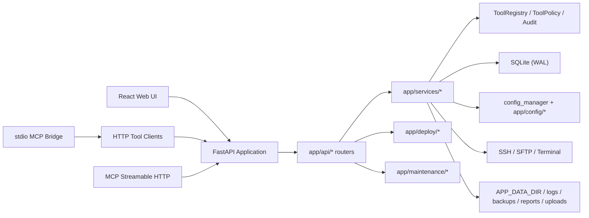
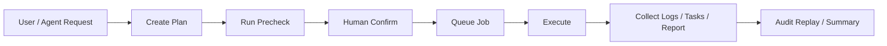
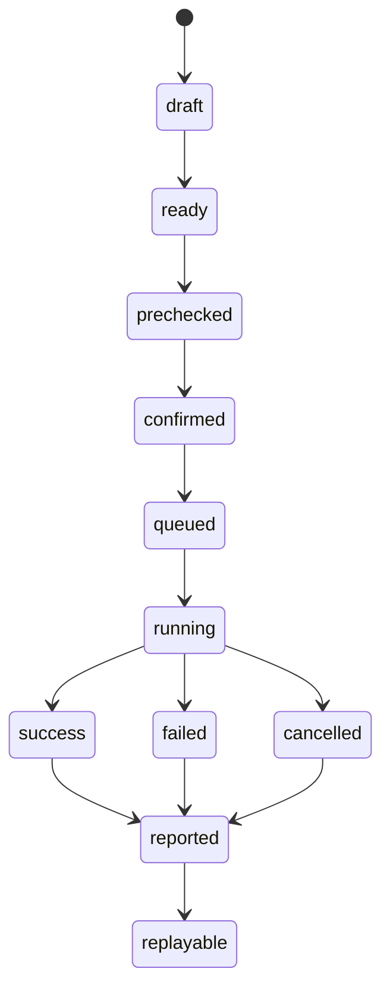
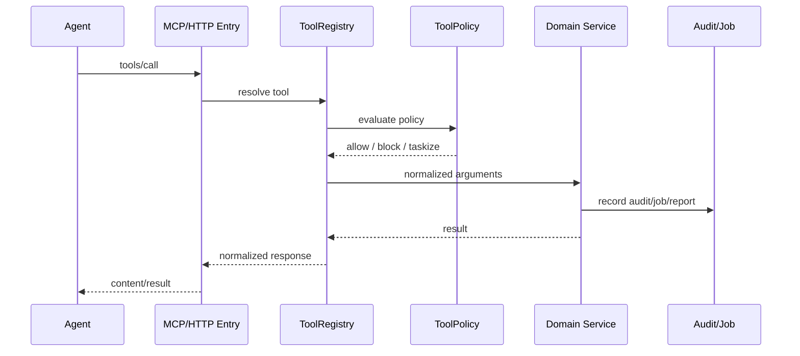

# OPS Platform AI Agent Next Iteration Implementation Plan

> **For Codex:** REQUIRED SUB-SKILL: Use superpowers:executing-plans to implement this plan task-by-task.

**Goal:** 在不引入 Redis、复杂分布式组件和多机编排的前提下，把当前 OPS Platform 迭代为适合小团队长期维护的本地化 AI Agent + MCP 运维平台，并按照“平台收敛 -> 资源优化 -> MCP 成熟化”的顺序推进。

**Architecture:** 继续采用模块化单体架构，以 `FastAPI + React + SQLite(WAL)` 为核心，统一“配置源、执行骨架、工具清单、任务状态、审计链路”，让 Web UI、HTTP Tool、MCP Streamable HTTP 和 stdio bridge 共用同一套 service contract。高风险操作统一收敛到 `plan -> precheck -> confirm -> job -> audit -> report -> replay`。

**Tech Stack:** Python 3.14, FastAPI, SQLAlchemy, SQLite(WAL), React 18, TypeScript, Vite, Zustand, Paramiko, MCP Streamable HTTP, stdio MCP bridge, local filesystem runtime.

---

## 0. 基线与约束

### 0.1 已验证基线

在 2026-05-20 的本地检查中：

- 后端测试：`venv\Scripts\python.exe -m pytest tests -q` 通过，`51 passed`
- 前端类型检查：`frontend\npm run typecheck` 通过
- 前端构建：`frontend\npm run build` 通过

### 0.2 不变约束

- 项目场景：本地部署、小团队、内部使用
- 运维策略：单机优先、极简优先、低资源占用优先
- 基础设施约束：暂不引入 Redis、消息队列、Kubernetes、分布式任务平台
- 数据策略：SQLite 继续作为控制面和运行面主库，保留 WAL
- Agent 策略：服务端不内建复杂自治智能体，只暴露安全、可审计、可编排的 Tool / MCP 能力

### 0.3 本次规划的主线顺序

严格按照以下顺序实施：

1. 平台收敛
2. 资源优化
3. MCP 成熟化

该顺序不可颠倒。原因是当前项目的主要问题不是功能缺失，而是复杂度开始积累；如果先继续扩 Agent/MCP，会放大已有的结构漂移。

---

## 1. 项目现状分析

## 1.1 当前架构图



## 1.2 当前目录与模块结构

| 区域 | 主要路径 | 当前职责 | 评价 |
| --- | --- | --- | --- |
| 应用入口 | `main.py` | 启动、middleware、router 挂载、静态资源托管 | 方向正确，但入口逻辑继续膨胀会变重 |
| API 层 | `app/api/*` | 鉴权、请求转换、响应封装 | 大部分 router 已分域，但 `deploy_v2.py` 过大 |
| 发布域 | `app/deploy/*`, `app/api/deploy_v2.py` | 发布计划、预检、执行、日志、报告、回滚 | 核心价值域，已有完整骨架，但复杂度集中 |
| 工具/MCP | `app/services/tool_*`, `app/api/tools.py`, `app/mcp/server.py` | Tool 注册、权限、审计、MCP/HTTP/stdio 暴露 | 设计方向对，但有重复实现 |
| 资源与维护 | `app/services/runtime_resources.py`, `app/maintenance/*` | 资源盘点、备份、清理、数据库维护 | 很贴合本地项目场景，适合继续增强 |
| 服务器工作台 | `app/api/servers.py`, `app/services/server_ops.py`, `app/services/terminal_sessions.py` | 服务器资产、终端、命令执行、文件操作 | 功能完整，但配置源不统一 |
| 前端 | `frontend/src/*` | 运维面板、任务中心、发布页、工具页 | 路由齐全，但多个页面体量过大 |
| 测试 | `tests/*` | 契约和回归测试 | 覆盖关键骨架，是当前项目的重要资产 |

## 1.3 当前技术栈

后端：

- FastAPI
- SQLAlchemy
- SQLite + WAL
- Paramiko
- Pydantic v2

前端：

- React 18
- TypeScript
- Vite
- Zustand
- `@xterm/xterm`

Agent / MCP：

- HTTP Tool API
- MCP Streamable HTTP
- stdio MCP bridge
- 风险策略、工具权限、审计日志

## 1.4 当前启动与运行流程

1. `main.py` 启动 FastAPI，初始化日志、CORS、中间件和路由。
2. `lifespan()` 中初始化数据库、默认用户、运行目录、密钥迁移、清理恢复、发布 Worker。
3. 后端根据 `frontend/dist` 状态决定是否托管 SPA。
4. Web UI 与 MCP/HTTP Tool 共享同一个后端进程。
5. 高风险 Tool 调用进入 `OperationJob`；发布执行进入 deploy worker。

## 1.5 当前数据流

### Web UI 数据流

`React Page -> frontend/src/api/* -> app/api/* -> app/services/* -> SQLite / SSH / Runtime FS`

### MCP 数据流

`External Agent -> /api/v2/mcp or /api/v2/tools/call -> ToolRegistry -> ToolPolicy -> ToolAdapter -> Service -> Audit / Job / Response`

### 发布数据流

`UI or MCP -> create plan -> precheck -> confirm -> execute -> deploy task -> logs/tasks/report -> audit chain`

## 1.6 当前权限体系

- Session 用户：`readonly / operator / admin`
- Tool Token：`scopes + allow_write + allow_prod`
- Workspace 环境头：`DEV / TEST / PROD`
- 高风险动作：确认短语 + 风险策略 + 任务中心

该体系适合本地小团队，建议保留并继续收敛，不要引入复杂 RBAC 平台。

## 1.7 当前优点

- 产品定位清晰：本地、小团队、内部运维、AI Agent 接入
- 功能闭环完整：发布、服务器、数据库、维护、报告、审计、MCP
- 风险治理方向正确：默认只读、高风险确认、统一审计
- 测试基线健康：核心契约已有回归覆盖
- 资源治理意识较好：SQLite WAL、智能轮询、资源清理、会话上限

## 1.8 当前问题列表

| 编号 | 问题 | 位置 | 影响 |
| --- | --- | --- | --- |
| I-01 | 超大文件过多 | `app/api/deploy_v2.py`、多个大页面 | 修改风险高、AI Agent 难以稳定增量开发 |
| I-02 | 配置源漂移 | `config_manager`、`app/config/*`、SQLite 模型并存 | UI、MCP、脚本、导入导出逻辑难统一 |
| I-03 | 后台任务模型有两套 | deploy worker 与 `OperationJob` 并行 | 状态查询、重试、审计口径不一致 |
| I-04 | MCP/HTTP/stdio 描述层重复 | `app/api/tools.py` 与 `app/mcp/server.py` | 容易出现 manifest、prompt、tool 说明漂移 |
| I-05 | 轮询链路偏重 | 发布页每轮拉多类接口 | 本地 CPU/IO/SQLite 压力会随页面增长放大 |
| I-06 | 资源盘点为同步扫描 | `runtime_resources.py` | 目录大时会带来页面抖动和 IO 峰值 |
| I-07 | 文档与中文字符串可读性风险 | 多处文档/终端输出 | 小团队维护和 AI Agent 解析成本高 |

## 1.9 风险点列表

- 发布链路是主价值域，也是当前最容易被“微调改坏”的区域
- 服务器资产配置一旦继续分叉，会影响发布、数据库代理、工作台和 MCP
- 如果先扩 Tool 数量而不先统一 Tool manifest，会扩大维护成本
- 如果把所有状态都改成实时扫描或实时推送，会引入不必要复杂度

## 1.10 技术债分析

### 结构技术债

- `app/api/deploy_v2.py` 当前约 `3143` 行
- `frontend/src/pages/ApplicationDetailPage.tsx` 当前约 `1321` 行
- `frontend/src/pages/ServerListPage.tsx` 当前约 `1207` 行
- `frontend/src/pages/PipelinePage.tsx` 当前约 `1028` 行
- `frontend/src/pages/DatabaseToolsPage.tsx` 当前约 `944` 行

### 资源技术债

- 发布轮询仍是“多接口拼装”
- 资源看板依赖目录扫描
- xterm bundle 体积较大，但已按页面懒加载，当前不属于首要问题

### 接口技术债

- MCP 资源、Prompt、Tool 元信息存在多套拼装逻辑
- 工具响应结构虽然整体趋于统一，但读/写/任务化之间仍有细微差异

---

## 2. 整体优化方向与优先级

## 2.1 P0：必须优先完成的平台收敛

### 优化目标

- 统一配置源
- 统一发布执行骨架
- 统一高风险任务状态口径
- 为后续资源优化和 MCP 成熟化建立稳定骨架

### 改造原因

当前主要问题不是缺功能，而是核心骨架散落在不同入口中。如果不先收敛，后续所有新增 Tool、页面和 Agent 流程都会继续叠加复杂度。

### 实现方案

1. 拆分 `app/api/deploy_v2.py` 为多个子模块，但保留原路由兼容。
2. 抽出“发布契约层”，统一 `plan / precheck / execute / report / rollback readiness`。
3. 抽出“资产与配置源服务”，把服务器、系统、服务、分组的读取收口到统一 service。
4. 把 deploy worker 与 `OperationJob` 的状态查询口径统一为“任务视图层”，哪怕底层执行器暂时仍分开。
5. 统一 request_id / operation_id / audit_id 贯穿日志、任务和报告。

### 技术细节

- API 层只做鉴权、参数解析、响应封装
- Service 层负责业务规则
- ToolAdapter 只负责把 Tool schema 映射到 Service contract
- 配置文件仅保留 bootstrap/default/import-export 功能
- SQLite 继续作为运行态与控制态主存储

### 风险分析

- 路由拆分可能引入 import cycle
- 配置源收口可能影响现有导入导出脚本
- 任务状态统一视图如果一次性重构过大，容易引发回归

### 资源消耗分析

- 短期开发成本上升
- 运行时资源几乎不增加
- 长期能显著降低重复扫描和重复拼装带来的 CPU/IO 消耗

### 对现有系统影响

- 路由、页面、MCP 入口均会受益
- 不需要新增基础设施

### 兼容性

- 必须保留现有 REST path 和 Tool name
- 必须保留 legacy MCP gateway 兼容层

### AI Agent 可执行开发步骤

1. 先创建新模块，不删除旧接口。
2. 让旧文件改为调用新模块。
3. 跑现有契约测试验证。
4. 在测试稳定后再逐步下沉逻辑。

### 验收标准

- `tests/test_release_reliability_contract.py` 全绿
- `tests/test_iter36_release_orchestration_contract.py` 全绿
- 所有现有 Tool 名称和 API path 兼容
- `deploy_v2.py` 主文件行数明显下降

## 2.2 P1：重要的资源优化

### 优化目标

- 降低轮询压力
- 降低目录扫描成本
- 降低页面拼装成本
- 给本地单机环境留出更大余量

### 改造原因

当前系统对本地小团队仍可用，但随着页面和日志增长，轮询、扫描、日志查询会成为主要热点，而不是模型调用或数据库连接数。

### 实现方案

1. 为发布页增加聚合状态接口，合并日志、任务摘要、部署摘要。
2. 为维护页增加资源快照服务，目录扫描改为缓存快照。
3. 为 Tool/Capability 页面增加能力版本缓存和轻量 diff。
4. 为任务中心增加分页和状态摘要缓存。
5. 收敛前端轮询策略，默认“当前任务快轮询，后台页面慢轮询，隐藏页退避”。

### 技术细节

- WebSocket 只用于 terminal 和必要流式日志
- 普通页面优先保留 polling，不强行引入 SSE
- 资源快照 TTL 建议 `30s~60s`
- 发布日志增量拉取优先于全量重刷

### 风险分析

- 快照引入缓存后可能出现短时延迟
- 聚合接口如果设计过大，可能变成新的巨型 endpoint

### 资源消耗分析

- 目标将发布页周期性请求数降低 `60%+`
- 目标将资源看板全目录扫描频率降到手动强刷或低频自动刷新
- 目标将运行期 SQLite 热点从“多次明细读”转为“少量摘要读”

### 对现有系统影响

- 主要影响发布页、维护页、任务页和工具页
- 不影响部署脚本、数据库结构主线

### 兼容性

- 旧接口保留，前端逐页切换到聚合接口

### AI Agent 可执行开发步骤

1. 先新增聚合接口和快照接口。
2. 前端通过 feature switch 切换。
3. 确认 UI 无回归后再收缩旧轮询链路。

### 验收标准

- 发布页轮询接口调用次数显著下降
- 维护页加载稳定，无明显阻塞
- `useSmartPolling` 继续作为统一轮询基建

## 2.3 P2：增强能力建设

### 优化目标

- 让 Agent/MCP 更像平台能力，而不是多个拼接接口
- 让 Prompt、Tool、资源、报告形成统一生态

### 改造原因

当前 MCP 能用，但描述、资源、Prompt、stdio bridge 仍有重复代码。P2 的目标不是“增加更多 Tool”，而是让 Tool 增长变得廉价。

### 实现方案

1. 让 `ToolRegistry` 成为唯一能力源。
2. 统一生成 HTTP Tool、MCP Tool、OpenAI/Anthropic function schema、Prompt manifest。
3. 新增轻量 Prompt Registry 与 Tool 分类说明。
4. 为常见运维任务提供 Agent workflow template，而不是让模型自由发挥。

### 技术细节

- Prompt 存文件，注册元信息存 Python manifest
- 不做复杂向量记忆
- Memory 只保留运行上下文、计划上下文、报告上下文

### 风险分析

- manifest 统一化若一步切太大，可能影响老客户端

### 资源消耗分析

- 增加少量元信息构建成本
- 降低长期维护成本和 Agent 调试成本

### 对现有系统影响

- 工具页、MCP 入口、stdio bridge 都会受影响

### 兼容性

- 保留原 `/api/v2/mcp/legacy`
- 保留原 Tool name alias

### AI Agent 可执行开发步骤

1. 先实现统一 manifest builder。
2. 让新入口引用 builder。
3. 最后回收重复逻辑。

### 验收标准

- Tool 元信息只存在一套权威生成逻辑
- 新增 Tool 不再需要同时修改多处 manifest 代码

## 2.4 P3：长期规划

### 优化目标

- 在不失控的前提下，为未来多 Agent 协作和插件化做准备

### 改造原因

当前项目仍处于“单团队可控平台”阶段，不应过早做复杂平台化，但可以预留清晰扩展点。

### 实现方案

- Tool Pack 插件目录
- Agent Workflow 模板库
- 可选的独立后台 worker 进程
- 更强的审计回放和报告中心

### 验收标准

- 扩展点清晰
- 无需额外基础设施即可继续演进

---

## 3. 重点优化方案

## 3.1 功能设计优化

### 当前判断

- 功能不缺，边界在漂移
- 发布、配置、服务器资产、数据库维护、Tool/MCP 都已具备平台雏形
- 问题在于“同一能力有多个入口和多个状态模型”

### 新模块划分建议

| 模块 | 目标职责 | 现有来源 | 改造方向 |
| --- | --- | --- | --- |
| Inventory Domain | 系统、服务、服务器、分组、环境读取与解析 | `config_manager`, `app/config/*`, 部分 DB | 收口为统一读取服务 |
| Release Domain | 计划、预检、执行、回滚、报告 | `app/api/deploy_v2.py`, `app/deploy/*`, `release_plan.py` | 提炼统一发布契约 |
| Runtime Domain | 日志、资源、快照、任务概览 | `runtime_resources.py`, `job_service.py` | 建立摘要和快照层 |
| Tooling Domain | Tool registry、policy、audit、manifest | `tool_*`, `api/tools.py`, `mcp/server.py` | 统一描述源 |
| Maintenance Domain | 备份、恢复、清理、数据库维护 | `app/maintenance/*`, `backup_service.py` | 维持独立域，避免与发布域混合 |

### 推荐目录结构

```text
app/
  api/
    deploy/
      __init__.py
      plans.py
      precheck.py
      executions.py
      history.py
      rollback.py
    tools.py
    mcp.py
    servers.py
    maintenance.py
  domain/
    inventory/
      services.py
      models.py
      adapters.py
    release/
      contracts.py
      planner.py
      precheck.py
      executor.py
      report.py
    runtime/
      snapshots.py
      jobs.py
      telemetry.py
    tooling/
      manifest.py
      prompts.py
      resources.py
  services/
    tool_adapters/
    ai_diagnostics.py
    runtime_resources.py
    server_ops.py
  agent/
    prompts/
    workflows/
    policies/
```

### 模块职责规范

- Router 不直接写核心业务逻辑
- Service 不依赖前端和 MCP 细节
- ToolAdapter 只做 schema 和 service contract 映射
- Prompt 不直接写业务规则，只组合 Tool 使用策略

### API 规范

- 统一返回 `ok / summary / result / next_actions / blocked / risk / audit_id`
- 读接口优先返回摘要 + 明细分页
- 高风险写接口必须带 `confirm_text`
- 聚合接口命名明确为 `summary` / `snapshot` / `status`

### Agent 调用规范

- Agent 默认只使用 read-only Tool
- 任何写操作必须走 `plan -> confirm -> execute`
- 不允许 Agent 直接拼 shell 或 SQL 绕过 Tool
- Agent 输出必须引用 `job_id / audit_id / report_id / plan_id`

## 3.2 流程逻辑优化

### 当前执行流程问题

- 发布链路完整，但状态读模型分散
- 高风险 Tool 任务化很好，但 deploy worker 没完全纳入统一查询口径
- 前端轮询以页面视角拼装，不是以“任务流”视角拉取

### 优化后发布流程



### 统一状态机



### 任务编排建议

- 保留 deploy worker 与 `OperationJob` 的执行器差异
- 新增统一任务视图层 `Runtime Job View`
- 所有页面和 Agent 只看统一视图，不直接感知底层执行器差异

### 重试机制

- Read Tool：允许幂等重试
- Precheck：允许自动重试一次
- Execute：不自动重试，只允许基于计划显式重试
- Cleanup / Restore / SQL Write：禁止隐式重试

### Agent 工作流设计

| 工作流 | 允许工具 | 禁止动作 |
| --- | --- | --- |
| 诊断 | diagnostics, reports, jobs, audit | deploy, rollback, restore, SQL write |
| 发布规划 | inventory, packages, deploy plan, precheck | direct execute |
| 发布执行 | execute_deploy_plan, get_job_status | bypass confirm |
| 数据库查询 | list_tables, describe_table, query_readonly, export | raw DB scripts |
| 审计回放 | operation chain, reports, tool calls | any write action |

### MCP Tool 调用链设计



## 3.3 资源占用优化

### 当前瓶颈

- 发布页轮询会连续请求日志、任务、部署详情
- 维护页资源盘点依赖同步目录扫描
- 大页面体积大，认知成本高于纯 bundle 成本
- `xterm` 体积大但已懒加载，当前不是 P0

### 资源优化建议

#### CPU

- 把聚合计算前置到后台快照
- 页面只拉摘要，不重复拼装

#### 内存

- 终端会话继续保持全局上限
- 日志前端缓冲继续限制最大行数
- 报告大对象不长期留在内存，落盘后按需读

#### IO

- 目录扫描改为快照缓存
- 日志优先增量拉取
- 大文件导出直接写 report artifact，不在内存拼完整结果

#### 数据库连接

- 保持单 engine 模式
- 避免页面一轮轮询触发多次 count/detail 查询
- Tool 和 UI 共用统一摘要表述

#### 线程 / 后台任务

- 控制本地后台线程数量
- 高风险任务执行线程统一入口
- deploy worker 可继续存在，但状态查询必须统一

#### 日志占用

- 结构化日志加 request_id / operation_id / job_id
- 保留滚动日志
- 对 report 与 audit artifact 做定期清理预览

#### 大模型成本

- 服务端不内置模型推理
- AI 客户端只消费 Tool/MCP
- 后端只提供可审计、可重复的 deterministic service

### 可量化目标

| 指标 | 当前判断 | 目标 |
| --- | --- | --- |
| 发布页每轮请求数 | 3~4 类接口 | 降到 1~2 个聚合接口 |
| 资源页全量扫描 | 页面刷新即可能触发 | 改为 TTL 快照 + 手动强刷 |
| 超大文件数量 | 多个 > 900 行 | P0 后核心文件降至 < 800 行 |
| Tool manifest 生成点 | 多处 | 统一为 1 处 |

### 单机最佳实践

- 保持模块化单体
- 保持 SQLite + WAL
- 保持轻量线程/协程模型
- 保持本地文件系统为 runtime 主存储
- 保持显式备份、显式恢复、显式审计

明确不做：

- 微服务拆分
- Redis 缓存层
- 分布式任务平台
- Kubernetes
- 外部事件总线

---

## 4. AI Agent 与 MCP 方案

## 4.1 推荐 Agent 架构

### Agent 类型

| 类型 | 职责 | 默认权限 |
| --- | --- | --- |
| Planner Agent | 读取能力、生成计划、做预检建议 | 只读 |
| Operator Agent | 调用低风险工具完成常规任务 | 只读或低风险写 |
| Guarded Executor | 执行已确认计划 | 高风险写，必须任务化 |
| Auditor Agent | 回放审计链、汇总报告 | 只读 |

### Agent 生命周期

1. 发现能力
2. 建立上下文
3. 生成计划
4. 预检/读取证据
5. 请求确认
6. 调用执行工具
7. 观察任务
8. 输出报告/回放证据

### Agent 调度原则

- 默认单 Agent 即可
- 高风险操作不做并发执行
- 多 Agent 协作只允许发生在“只读诊断”和“报告分析”场景

### Agent 权限控制

- Session 用户权限
- Tool Token 范围
- Tool category 风险级别
- Workspace 环境 `DEV/TEST/PROD`
- Confirm text 与任务中心双门禁

### Agent 上下文管理

只保留三类上下文：

- Request Context：本次用户请求
- Operation Context：本次计划、任务、审计 ID
- Artifact Context：报告、日志、导出结果

不引入复杂长期向量记忆。长期信息由数据库、计划、报告、审计记录承担。

### Prompt 管理规范

推荐新增：

```text
app/agent/prompts/
  release_plan.md
  diagnostic_triage.md
  db_workflow.md
  backup_workflow.md
  audit_replay.md
```

Prompt 只负责：

- 定义工作流顺序
- 限定可用 Tool
- 规定禁止动作
- 规定输出格式

Prompt 不直接嵌业务硬编码。

### Tool Registry 规范

- Python decorator 注册
- 自动生成 MCP / HTTP / OpenAI / Anthropic schema
- Tool category、risk、scopes 为必填
- Tool 返回结构标准化

## 4.2 MCP 能力设计

### 推荐架构

- `ToolRegistry` 为唯一能力源
- `app/api/tools.py` 提供 HTTP Tool 与 MCP HTTP
- `app/mcp/server.py` 只做 stdio bridge，不再维护独立 Tool 描述逻辑

### Tool 注册规范

Tool 必须包含：

- name
- title
- description
- input_schema
- category
- risk
- scopes
- requires_confirmation
- output_schema

### Tool 调用协议

统一返回：

```json
{
  "ok": true,
  "tool": "ops.some_tool",
  "result": {},
  "summary": "human-readable summary",
  "next_actions": [],
  "audit_id": "optional",
  "job_id": "optional",
  "risk": "low|medium|high|critical",
  "blocked": false,
  "requires_confirmation": false,
  "message": "success"
}
```

### Tool 安全设计

- 默认只读
- 生产动作必须 `allow_prod`
- 高风险/关键风险必须确认短语
- 高风险写 Tool 默认进入任务中心
- 所有 Tool 调用写审计

### Tool 超时机制

| 类型 | 建议超时 |
| --- | --- |
| 只读查询 | 3s ~ 10s |
| 诊断扫描 | 10s ~ 30s |
| 上传/导出 | 30s ~ 120s |
| 高风险执行 | 任务化，不在 HTTP 同步等待 |

### Tool 日志规范

统一记录：

- tool_name
- actor
- auth_type
- token_id / username
- input digest
- result summary
- risk
- duration_ms
- audit_id / job_id / plan_id / deployment_id

---

## 5. 数据库与配置优化方案

## 5.1 当前问题

- 服务器、系统、服务、分组存在配置文件和 SQLite 并存
- 运行态和配置态边界未完全明确
- 日志、任务、导出、报告表已经不少，但索引策略仍可强化

## 5.2 目标设计

### 数据职责划分

| 类型 | 推荐唯一来源 |
| --- | --- |
| 运行态任务、审计、报告、DML 历史、Tool Token | SQLite |
| 运行时目录路径、环境默认值、bootstrap 模板 | 文件配置 + env |
| 服务器/系统/服务/分组 | 逐步迁移为 SQLite 主源，文件保留导入导出能力 |

### 迁移原则

- 先收口读取，再考虑迁移写入
- 文件配置保留导入导出，不作为长期主源
- `config_manager` 最终收敛为 compatibility adapter

## 5.3 表与索引优化建议

建议优先检查并补充以下索引：

- `tool_call_logs(tool_name, status, created_at)`
- `operation_jobs(status, created_at)`
- `tool_plans(plan_type, status, created_at)`
- `deploy_logs(deployment_id, created_at)`
- `report_artifacts(report_type, created_at)`
- `deploy_package_refs(package_name, deployment_id, created_at)`

## 5.4 SQL 风险分析

- SQLite 适合当前规模，但必须避免大事务扫表
- DML 工具继续保留 preview/execute 两阶段
- 迁移脚本必须幂等
- 不要把“配置迁移”和“运行态清理”放在同一事务中

## 5.5 慢查询与归档策略

- 发布历史、工具调用、报告中心都要支持 retention
- 归档优先做“预览 -> 确认 -> 清理”
- 大导出文件直接归 report center，定期清理 artifact

## 5.6 配置系统规范

### 目录规范

```text
config/
  bootstrap/
    systems.yaml
    servers.yaml
  templates/
    prompt_defaults.yaml
    release_templates.yaml
  defaults.py
```

### 环境变量规范

- `.env.example` 只放跨环境必需项
- 运行目录类配置保持显式，如 `APP_DATA_DIR`
- MCP / Tool token / mode 开关都应有默认安全值

### 热更新策略

- 只读描述类配置允许热更新
- 安全/连接/目录/执行策略类配置需要显式 reload
- 生产相关配置修改必须记审计

---

## 6. 前端与 UI/UX 优化方案

## 6.1 设计目标

- 极简但高信息密度
- 对运维人员低学习成本
- 对 Agent 友好，页面数据结构清晰
- 保持暗色模式和快速导航

## 6.2 UI 重构建议

### 顶层导航建议

现有导航信息较多，建议逻辑收敛为六大工作面：

1. Dashboard
2. Release
3. Inventory
4. Database
5. Runtime & Reports
6. Tool Access

实现方式：

- 路由不立即删除
- 先在 UI 层做分组收敛
- 旧路径保留 alias

### 页面设计重点

| 页面 | 当前问题 | 优化建议 |
| --- | --- | --- |
| DeployPage | 轮询链路重，面板拼装多 | 聚合状态接口 + 分区卡片 |
| TaskCenterPage | 状态与发布链路未完全统一 | 引入统一任务视图 |
| ToolAccessPage | 更偏功能清单 | 增加 capability version、Prompt、Resource、风险策略可视化 |
| SystemStatusPage / Diagnostics | 数据来源分散 | 使用 runtime snapshot |
| ServerListPage | 页面过大 | 拆为列表、资产健康、批量操作子组件 |
| DatabaseToolsPage | 职责复杂 | Query / Export / DML / Cleanup 分 tab 明确化 |

### Agent 面板设计

新增或增强：

- 最近可用 Tool
- 最近执行计划
- 最近任务
- 最近报告
- 最近风险拦截

目的不是“做聊天框”，而是做“可审计的 AI 操作台”。

## 6.3 前端技术建议

- 继续使用 React + TypeScript + Zustand
- 保持 `frontend/src/api/*` 的 typed wrapper 方向
- 保持 `useSmartPolling` 作为通用轮询基建
- Terminal 继续 WebSocket
- 普通页面继续 polling，不强行全局 SSE

## 6.4 流式输出建议

- Terminal：保留 WebSocket
- 部署日志：优先增量 polling；确有需要再对单部署日志引入 streaming
- AI 诊断结果：通过 report artifact 落盘，不做实时 token stream

---

## 7. DevOps 与部署方案

## 7.1 推荐部署方式

### 默认推荐

- 单机
- FastAPI 直托管 `frontend/dist`
- `APP_DATA_DIR` 放仓库外
- Windows 使用 `.bat`
- Linux 使用 `systemd` 或 `docker compose`

### 不推荐

- K8s
- 多服务拆分
- 独立缓存服务
- 独立消息队列

## 7.2 Docker / Compose / PM2 / Systemd 建议

| 方案 | 适用场景 | 结论 |
| --- | --- | --- |
| 单进程脚本启动 | 最小团队、本地机器 | 默认优先 |
| Docker Compose | 需要隔离与交付一致性 | 可选 |
| PM2 | Node 主体项目更适合 | 当前不推荐作为主方案 |
| systemd | Linux 长期运行 | 推荐 |

## 7.3 CI/CD 策略

继续坚持轻量流程：

1. 后端测试
2. 前端 typecheck
3. 前端 build
4. smoke / release check
5. 手动确认发布

不做复杂流水线编排。小团队内部系统更重视稳定与回滚清晰度。

## 7.4 回滚策略

- 发布回滚：继续以 ToolPlan / Rollback Plan 为核心
- 数据库回滚：备份优先，不做复杂 migration rollback 自动化
- 前端回滚：保留上一版 dist
- 配置回滚：配置快照 + 导入导出

## 7.5 日志体系

新增并统一：

- `request_id`
- `operation_id`
- `job_id`
- `audit_id`
- `deployment_id`

日志分类：

- 应用日志
- Tool 调用日志
- Agent 计划日志
- 部署日志
- 错误日志
- 审计日志

---

## 8. 安全方案

## 8.1 风险面分析

### Agent 权限

- 禁止默认写权限
- 生产环境必须显式授权

### Tool 权限

- category + risk + scope 三维控制
- 高风险统一任务化

### Prompt 注入

- Prompt 只描述流程，不允许内嵌绕过规则
- Prompt 明确声明“禁止直接 shell / SQL / 文件删除”

### MCP 风险

- Tool manifest 必须体现风险级别
- 读/写路径隔离

### API 风险

- Session 与 Tool Token 分离
- 统一鉴权与审计

### 本地文件权限

- 上传目录、备份目录、报告目录都在 `APP_DATA_DIR`
- 删除类操作必须确认短语

### Shell 执行风险

- 原生命令继续只给 admin
- 命令校验与脱敏继续保留

### SQL 风险

- 只读查询与 DML 严格分离
- DML 必须 preview + execute
- 生产库权限最小化

## 8.2 安全策略

- 默认只读
- 显式开写
- 生产双重门禁
- 所有高风险调用入任务中心
- 所有执行入审计链

## 8.3 审计方案

每次高风险操作都应可回答：

- 谁发起
- 用什么入口发起
- 传了什么参数
- 经过了哪些风险门禁
- 是否创建任务
- 最终结果是什么
- 可回放证据在哪里

## 8.4 风险隔离方案

- Tool 执行器与 Prompt 分离
- 计划与执行分离
- 配置态与运行态分离
- 诊断与改写分离

---

## 9. 分阶段实施计划

## 9.1 总体阶段表

| 阶段 | 时间 | 核心目标 |
| --- | --- | --- |
| 第一阶段 | 1~3 天 | 平台收敛，稳住骨架 |
| 第二阶段 | 4~7 天 | 资源优化 + Agent/MCP 基础成熟 |
| 第三阶段 | 1~2 周 | 自动化增强 + 长期稳定性建设 |

## 9.2 第一阶段（1~3 天）

### 必须完成

- 发布域拆分
- 配置源读取收口
- 统一任务视图层
- request_id / operation_id 贯穿
- 文档与编码整理

### 开发顺序

1. 抽取发布域契约
2. 拆分 `deploy_v2.py`
3. 建立 Inventory 统一读取服务
4. 建立统一任务视图
5. 保持旧路径兼容

### 文件改动范围

- `main.py`
- `app/api/deploy_v2.py`
- `app/deploy/*`
- `app/services/release_plan.py`
- `app/services/job_service.py`
- `app/api/tools.py`
- `app/api/servers.py`
- `tests/test_release_reliability_contract.py`
- `tests/test_iter36_release_orchestration_contract.py`

### 新增模块

- `app/api/deploy/plans.py`
- `app/api/deploy/precheck.py`
- `app/api/deploy/executions.py`
- `app/api/deploy/history.py`
- `app/domain/inventory/services.py`
- `app/domain/runtime/jobs.py`

### 风险点

- import cycle
- 路由回归
- 配置读取差异

### 回滚方案

- 保留原 `deploy_v2.py` 对新模块的转发壳
- 使用 feature switch 控制新聚合视图

### 验收标准

- 发布相关测试全绿
- 旧 API 与 Tool name 可用
- 关键超大文件被实质拆小

## 9.3 第二阶段（4~7 天）

### 必须完成

- 发布聚合状态接口
- Runtime snapshot 快照层
- Tool manifest 单一生成源
- Tool Access UI 优化
- Prompt registry 基础结构

### 开发顺序

1. 新增状态聚合接口
2. 前端发布页改用聚合接口
3. 资源页改为快照读取
4. MCP manifest 抽统一 builder
5. Tool Access 页面展示 capability version / resources / prompts

### 文件改动范围

- `app/services/runtime_resources.py`
- `app/api/tools.py`
- `app/mcp/server.py`
- `frontend/src/pages/DeployPage.tsx`
- `frontend/src/pages/deploy/*`
- `frontend/src/pages/ToolAccessPage.tsx`
- `frontend/src/pages/SystemStatusPage.tsx`
- `frontend/src/pages/SystemDiagnosticsPage.tsx`
- `frontend/src/hooks/useSmartPolling.ts`

### 新增模块

- `app/domain/runtime/snapshots.py`
- `app/domain/tooling/manifest.py`
- `app/agent/prompts/*`

### 风险点

- 缓存引起的短时延迟
- 新旧 manifest 一致性

### 回滚方案

- 前端保留旧轮询链路
- MCP 继续保留 legacy/旧 manifest 入口

### 验收标准

- 发布页请求数下降
- 资源页不卡顿
- Tool manifest 单一生成

## 9.4 第三阶段（1~2 周）

### 必须完成

- Agent workflow template
- 审计回放增强
- Tool Pack 扩展位
- 报告中心增强
- 运行时清理与保留策略完善

### 开发顺序

1. 完善 Prompt / workflow
2. 完善报告与回放
3. 完善 Tool Pack 扩展位
4. 完善保留与清理策略

### 文件改动范围

- `app/services/ai_diagnostics.py`
- `app/services/report_center.py`
- `app/services/audit_chain.py`
- `app/services/tool_adapters/*`
- `frontend/src/pages/ReportCenterPage.tsx`
- `frontend/src/pages/TaskCenterPage.tsx`
- `docs/runbooks/*`

### 新增模块

- `app/agent/workflows/*`
- `app/domain/tooling/resources.py`
- `app/domain/tooling/prompts.py`

### 风险点

- 扩展过度，偏离“小团队、单机、极简”目标

### 回滚方案

- 所有 workflow 均为增量新增
- 不改动主执行链，只增强读能力和模板能力

### 验收标准

- 新增 Tool/Prompt 的成本下降
- AI Agent 可直接按模板执行常见流程
- 报告与审计回放可覆盖大部分高风险动作

---

## 10. AI Agent 开发执行手册

## 10.1 执行原则

- 先读计划，再读代码
- 只修改被分配的模块
- 不跳过测试
- 不绕过 Tool / Policy / Audit
- 不引入额外基础设施

## 10.2 标准任务输入模板

```text
Task Goal:
Scope:
Allowed Files:
Must Keep Compatibility:
Verification Commands:
Risk Notes:
Definition of Done:
```

## 10.3 Definition of Done

- 功能实现完成
- 对应测试通过
- 未破坏旧接口
- 有必要的文档更新
- 有审计和错误处理

## 10.4 禁止事项

- 直接新增 Redis / MQ / 分布式组件
- 直接改 Tool name / API path
- 直接绕过发布计划与确认流程
- 直接用脚本替代现有数据库 Tool
- 直接把大文件继续做大

## 10.5 任务包

### Task 1: 发布域拆分与兼容壳

**Files:**

- Modify: `app/api/deploy_v2.py`
- Create: `app/api/deploy/plans.py`
- Create: `app/api/deploy/precheck.py`
- Create: `app/api/deploy/executions.py`
- Create: `app/api/deploy/history.py`
- Test: `tests/test_release_reliability_contract.py`
- Test: `tests/test_iter36_release_orchestration_contract.py`

**Implementation Steps:**

1. 提取计划、预检、执行、历史查询相关 handler。
2. 在原文件中保留导入与转发，确保 route path 不变。
3. 为新模块补充最小单元测试或复用现有契约测试。
4. 运行发布相关回归测试。
5. 提交为独立 commit。

**Run:**

```bash
venv\Scripts\python.exe -m pytest tests\test_release_reliability_contract.py tests\test_iter36_release_orchestration_contract.py -q
```

**Expected:**

- 所有发布契约测试通过

### Task 2: 配置源读取收口

**Files:**

- Create: `app/domain/inventory/services.py`
- Modify: `app/api/servers.py`
- Modify: `app/api/deploy_v2.py`
- Modify: `app/services/tool_adapters/deploy_tools.py`
- Test: `tests/test_release_reliability_contract.py`

**Implementation Steps:**

1. 定义统一读取接口，返回系统、服务、服务器、分组和环境数据。
2. 先替换读取端，不立刻迁移写入端。
3. 对旧 `config_manager` 保留 compatibility adapter。
4. 验证发布、服务器列表、数据库代理场景不回归。
5. 提交为独立 commit。

**Run:**

```bash
venv\Scripts\python.exe -m pytest tests\test_release_reliability_contract.py tests\test_auth_and_maintenance_regressions.py -q
```

**Expected:**

- 读取路径统一
- 现有功能保持兼容

### Task 3: 统一任务视图层

**Files:**

- Create: `app/domain/runtime/jobs.py`
- Modify: `app/services/job_service.py`
- Modify: `app/api/tools.py`
- Modify: `app/api/deploy_v2.py`
- Test: `tests/test_iter35_job_center_contract.py`

**Implementation Steps:**

1. 抽象统一任务摘要模型。
2. 把 `OperationJob` 与 deploy task 的状态汇总到统一查询视图。
3. 页面和 Tool 读取统一任务视图，不直接感知底层执行器差异。
4. 保持原始执行器不大改。
5. 提交为独立 commit。

**Run:**

```bash
venv\Scripts\python.exe -m pytest tests\test_iter35_job_center_contract.py tests\test_iter38_audit_chain_contract.py -q
```

**Expected:**

- 任务中心查询口径统一
- 审计链不回归

### Task 4: 发布聚合状态与资源快照

**Files:**

- Create: `app/domain/runtime/snapshots.py`
- Modify: `app/services/runtime_resources.py`
- Modify: `frontend/src/pages/deploy/useDeploymentPolling.ts`
- Modify: `frontend/src/pages/DeployPage.tsx`
- Modify: `frontend/src/pages/SystemStatusPage.tsx`
- Test: `tests/test_dashboard_iteration_contract.py`

**Implementation Steps:**

1. 新增部署状态聚合接口。
2. 新增资源快照接口与 TTL 缓存。
3. 发布页改为优先读取聚合状态。
4. 维护/状态页改为读取快照。
5. 提交为独立 commit。

**Run:**

```bash
venv\Scripts\python.exe -m pytest tests\test_dashboard_iteration_contract.py tests\test_release_hotfix_contract.py -q
cd frontend && npm run typecheck && npm run build
```

**Expected:**

- 后端测试通过
- 前端编译与构建通过

### Task 5: MCP Manifest 单一生成源

**Files:**

- Create: `app/domain/tooling/manifest.py`
- Modify: `app/api/tools.py`
- Modify: `app/mcp/server.py`
- Modify: `app/services/tool_registry.py`
- Test: `tests/test_iter37_ai_diagnostics_contract.py`

**Implementation Steps:**

1. 抽取统一 manifest builder。
2. HTTP Tool、MCP HTTP、stdio bridge 全部引用 builder。
3. 保留 legacy 入口。
4. 验证 Tool 列表、Prompt、Resource 一致性。
5. 提交为独立 commit。

**Run:**

```bash
venv\Scripts\python.exe -m pytest tests\test_iter37_ai_diagnostics_contract.py tests\test_risk_policy_contract.py -q
```

**Expected:**

- Tool/Prompt/Resource 描述统一
- 风险策略不回归

### Task 6: Tool Access 与 Agent 工作面优化

**Files:**

- Modify: `frontend/src/pages/ToolAccessPage.tsx`
- Modify: `frontend/src/routes.ts`
- Modify: `frontend/src/App.tsx`
- Create: `app/agent/prompts/release_plan.md`
- Create: `app/agent/prompts/diagnostic_triage.md`

**Implementation Steps:**

1. Tool Access 页展示 capability version、resources、prompts、risk policy。
2. 顶层导航做逻辑收敛，不删除旧路由。
3. 新增基础 prompt 文件并建立命名规范。
4. 验证页面构建通过。
5. 提交为独立 commit。

**Run:**

```bash
cd frontend && npm run typecheck && npm run build
```

**Expected:**

- 工具能力页更像平台控制面
- Prompt 有统一落点

---

## 11. 推荐目录结构

```text
ops-ai/
  app/
    api/
      deploy/
      tools.py
      servers.py
      maintenance.py
      system.py
    domain/
      inventory/
      release/
      runtime/
      tooling/
    deploy/
    maintenance/
    services/
      tool_adapters/
    agent/
      prompts/
      workflows/
      policies/
    db/
    config/
    mcp/
  frontend/
    src/
      api/
      pages/
        deploy/
        maintenance/
        tools/
      components/
      hooks/
      types/
  config/
    bootstrap/
    templates/
  docs/
    plans/
    runbooks/
  scripts/
  tests/
```

---

## 12. 推荐技术栈

## 12.1 保持不变

- FastAPI
- SQLAlchemy
- SQLite + WAL
- React + TypeScript + Vite
- Zustand
- Paramiko

## 12.2 可增加但保持轻量

- `orjson`：如果后续 JSON 序列化成为热点
- `APScheduler`：仅在确实需要内置定时清理时考虑；能用系统计划任务就不用

## 12.3 明确不引入

- Redis
- Celery
- Kafka / RabbitMQ
- Kubernetes
- 向量数据库
- 复杂工作流编排引擎

---

## 13. 风险与回滚策略

| 区域 | 主要风险 | 回滚方式 |
| --- | --- | --- |
| 发布域拆分 | 路由或导入回归 | 保留兼容壳，快速回切旧 handler |
| 配置源收口 | 读取结果与历史不一致 | 保留 compatibility adapter，启用 diff 对比 |
| 任务视图统一 | 页面状态显示异常 | 保留旧查询接口，前端 feature switch 回退 |
| 聚合接口与快照 | 缓存延迟导致误判 | 允许手动强刷，保留旧明细接口 |
| MCP manifest 统一 | 老客户端行为变化 | 保留 legacy endpoint 和 alias |
| UI 收敛 | 用户路径变化引发困惑 | 路由别名保留，渐进切换导航 |

### 通用回滚原则

- 先加新逻辑，再切换读取方
- 不删除旧接口，直到回归完成
- 所有高风险改造都要有 feature switch 或兼容壳

---

## 14. 长期迭代路线图

## 14.1 未来 1 个月

- 完成 P0 与 P1
- 稳住统一发布骨架
- 稳住统一任务与审计口径
- 降低轮询与扫描压力

## 14.2 未来 1~3 个月

- 完成 P2
- Prompt / Tool / Resource 统一平台化
- 报告中心和审计回放增强
- 常见 Agent workflow 模板化

## 14.3 未来 3~6 个月

- 视使用量决定是否拆出独立 worker 进程
- 视团队需要决定是否做 Tool Pack 插件化
- 继续保持单机优先，不做无必要分布式化

## 14.4 长期原则

- 平台稳定性优先于功能扩张
- Tool 安全性优先于 Agent 自治性
- 统一 contract 优先于接口数量增长
- 小团队维护成本优先于“看起来很先进”的架构

---

## 最终结论

当前项目最合适的演进方向不是做“大而全的 AI 平台”，而是把已有的本地运维平台收敛成“强约束、可审计、可扩展的模块化单体控制面”。

本次完整方案的核心排序只有三步：

1. 先收敛平台骨架
2. 再优化资源占用
3. 最后成熟化 MCP 与 Agent 能力

只要坚持这个顺序，项目可以在保持单机、低依赖、低运维成本的前提下，持续向更强的 AI Agent 协同能力演进。
